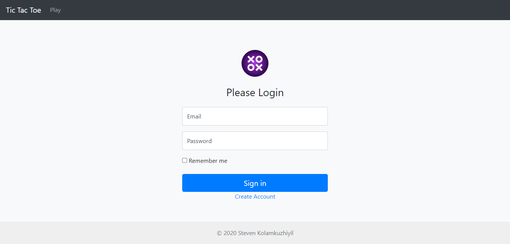
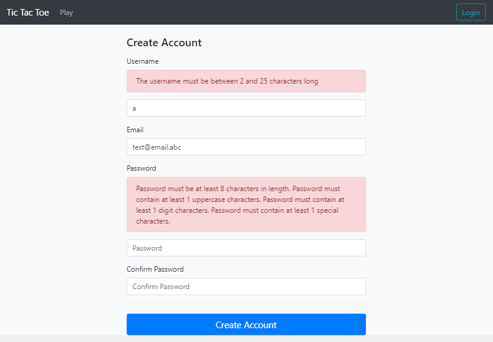

# SpringSecurity

A webapp used to learn concepts of Spring Security. Following security concepts were implemented: HTTPS, CSRF protection, XSS protection, 
SQL injection, authentication, authorization and form validation.

## Getting Started

Clone this repository and execute the application.

## Used Technologies

Java 8, Spring-Web, Spring-Security, Thymeleaf, Javascript, CSS, HTML, Bootstrap, JPA, Passay, H2 Database

### Improvements and additional features
Implement a PvP system and leaderboard.
